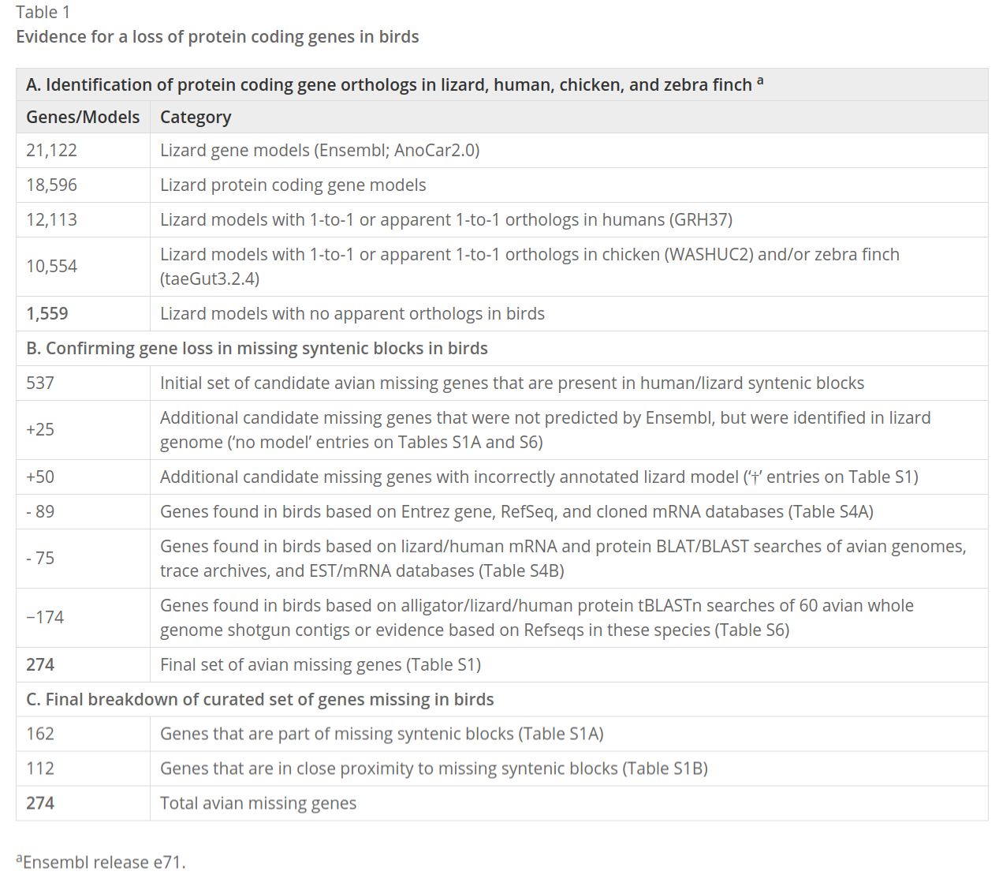
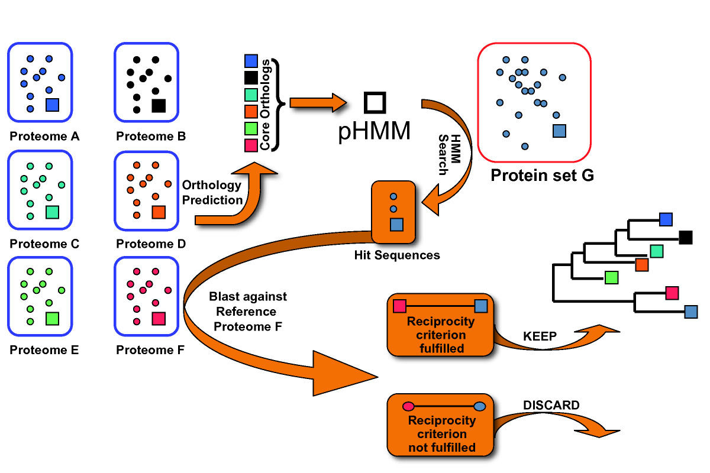
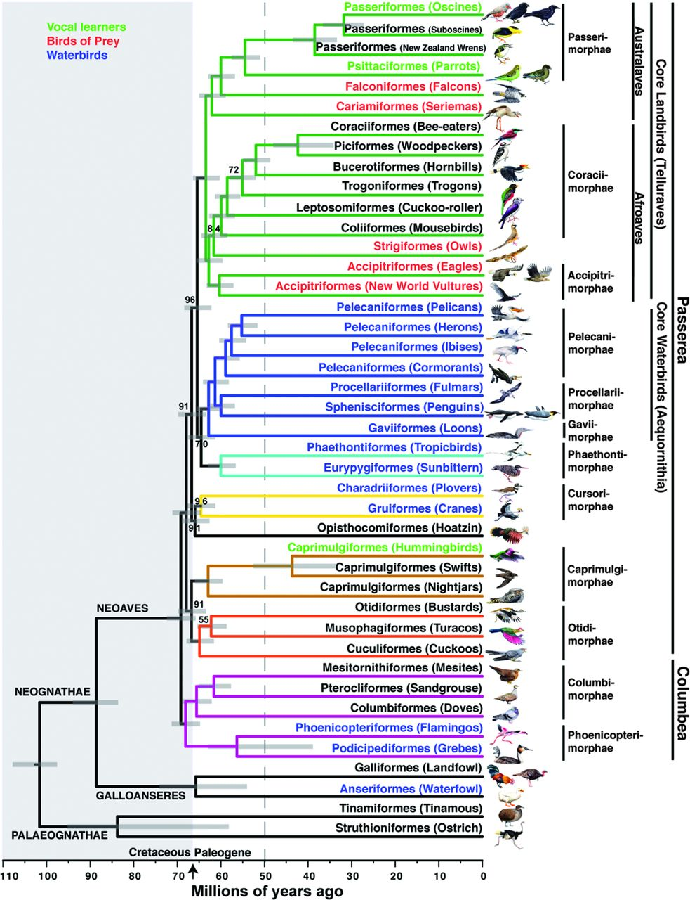
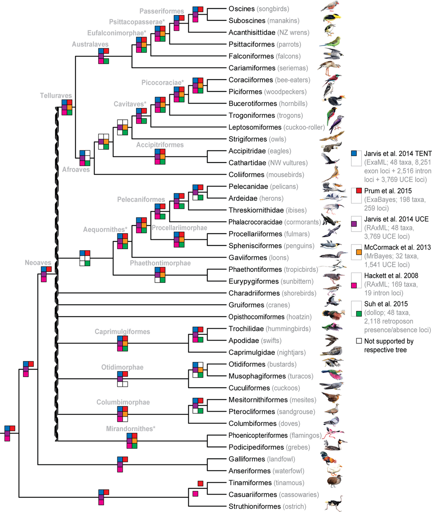
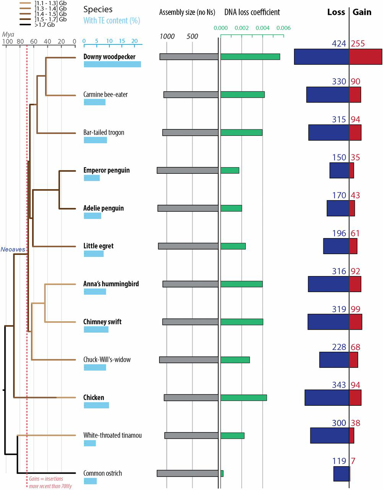
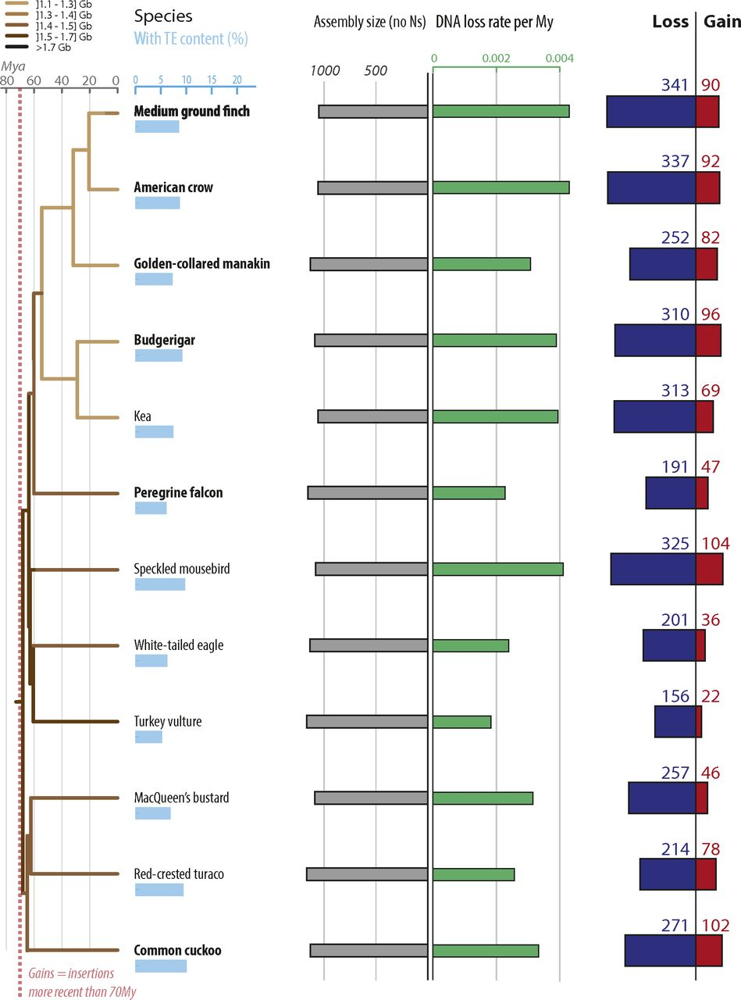
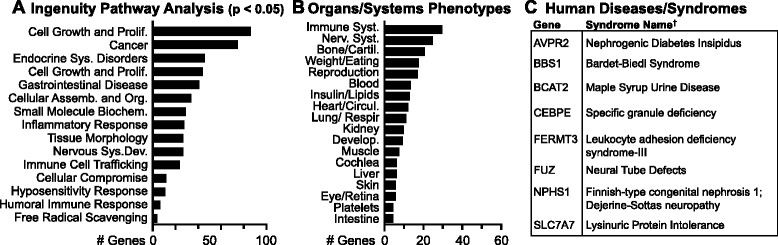

<!---
cd $Gao/office/; pandoc -i 171025-DongZ-ResearchProposal.md -o 171025-DongZ-ResearchProposal.docx --reference-docx=DongZ-WeeklyReport.docx
-->

# Research Proposal

## What is the general scientific question?

How to improve Zhao et al. (2015) 's pipeline and analyse gene loss in birds?

## What is my specific scientific question?

1. How to further filter the result of PseudoPipe?

1. How to apply the improved pipeline to a large lineage with sophisticated phylogenetic relationship, e.g. birds? 

1. How does gene loss correlate with genome size/gain/loss?
    
1. What roles do the gene lost play (take core landbirds and core waterbirds for example)? 

## What is my hypothesis?

1. We can further filter the result of PseudoPipe by perfrom ortholog prediction again using [HaMStR](https://bmcevolbiol.biomedcentral.com/articles/10.1186/1471-2148-9-157). We can also make the pipeline more user-friendly and ready for complex phylogeny.
  
1. To handle with paraphyletic groups in birds, we can focus on two cases for simplicity: _gene loss common to all speceis within a group_, and _gene loss unique to one species within a group_ ^[all other species in this group contains orthologous counterpart]. In this way, we can build a better catalog of unitary gene loss in birds than [Lovell et al. (2014)](https://genomebiology.biomedcentral.com/articles/10.1186/s13059-014-0565-1).

1. There maybe some interesting relationship between unitary gene loss and genome size/gain/loss.

1. Unitary gene loss maybe enrich in some important functions shaping core landbirds and core waterbirds.

    

## What is my experiment design plan to test the hypothesis?

1. fetch orthologous relationship from [OrthoDB](http://www.orthodb.org/) (54 bird species are available now, while Ensembl only contains 5), 运行师兄的 pipeline，并对 PseudoPipe 的结果进行额外的筛选，对于 "genic hits" 和 "intergenic hits" 中ORF完好的情况。用 HaMStR 对这些基因再做一遍直同源基因预测，若为阴性则意味着该假基因已经不属于这一直同源基因群，也就是说该基因在此物种中已丢失。简单来说，HaMStR 的原理是就是分析某一个基因是否是属于某一 orthologous group，这就需要该 orthologous group 的数个基因的蛋白质序列（core-orthologs set）以及一个参考物种的所有蛋白质序列。

    

    同时对师兄的脚本做一些改进：

    a. 我之前提到过的一些 bug

    b. 在脚本的第一步，会把 `GMAP_database` 等输入文件夹移动到物种缩略名对应的文件夹下，结果我每次运行完一次之后发现结果有问题，想再一次运行前，都得把这些文件夹再移回来。而且对于分析多个物种的 MRCA 时，还得额外为每个物种再准备一个 `GMAP_database`，既冗余又浪费空间。从程序本身的角度分析，也没有理由一定要这样设计。

    c. 在上一项的基础上，允许用户输入系统发育树，并在程序设计上预留进化模型处理模块。对于复杂的系统发育关系，本项研究为简便起见只考虑最简单的情况， 即只在一个物种中缺失，_时间允许的话可以增加考虑只在某一单系中缺失的情况_，未来可以加入多次缺失的考虑（这时需要区分是发生了多次缺失还是多次获得或其他更复杂的情况等）。

1. birds includes Palaeognathae（古颚总目) and Neognathae （今颚总目), and Neognathae includes Galloanseres (鸡雁小纲) 和 neoaves (新鸟小纲)。This study use lizard, turtle, alligator, Palaeognathae and Galloanseres as outgroup to investige unitary gene loss in neoaves. 

    

    根据 [Suh et al. (2016)](https://onlinelibrary.wiley.com/doi/10.1111/nyas.13295/full) 整理的鸟类系统发育结果，neoaves 被分为 9 个支系，这些支系内部的系统发育关系已经比较稳定，但是它们之间的系统发育关系却存在着很大的争论。所以这里我们将其作为并系群。一个重要的问题是 Zhao et al. (2015) 中的系统发育关系相对简单，简约法可以很容易地应用。但是对于 neoaves 而言，一方面物种数目太多，另一方面 9 个并系群较难处理。为了简便起见，我们这里仅关注两种类型，一种是在 9 个并系中的某一支系的所有物种共有的 gene loss （此时不考虑其它支系中的情况），一种是某一支系内部发生在某一物种中的 gene loss （该支系中的其它物种都含有该基因）。^[另外还要考虑 core waterbirds (位于 9 个并系中从上至下第 2 个支系内部的一个单系)，见最后一项] 相应的，对于 HamStR 的 core-orthologs set 的选取，在第一种其況下选取外群中的基因；在第二种情况下比较复杂，因为这 9 个支系的大小十分不均一，对于物种数比较多的支系，只需要选择支系中的其他物种，对于只有两三个物种的支系，就需要同时使用支系中的其他物种和外群。
    
    

    Lovell et al. (2014) 鉴定出了 274 个只在鸟类中缺失的基因 [^Lovell-result]。But the method he used has some limitations: one is that it heavily relies on synteny, which is exactly one of the challenges Zhao et al. (2015) wants to address; the other is that the number of species considered is too few，the result mainly based on chicken and zebra finch, although it uses several other birds in later filtering[^use-several-brids]. 第二个问题可能是由于 Jarvis 的论文是在 2014 年发表的，这篇文献虽然也是在 2014 年发表，但其主要工作应该是在之前完成的，那时还没有这么多数据。

    现在我们能尝试在两方面上都有所改进，而且扩展其研究范围。

    [^Lovell-result]: 
    > We found that approximately 274 genes that are present in conserved syntenic blocks or in close proximity to these blocks at discrete chromosomal locations in non-avian sauropsids and mammals are absent in all birds examined.

    [^use-several-brids]: 
    > Lastly, we found that a subset (174) of our candidate avian missing genes are present in one or several avian genomes recently assembled and submitted to NCBI, including those sequenced as part of the Avian Phylogenomics Consortium.

1. [Kapusta et al., 2017](http://www.pnas.org/content/114/8/E1460.full) 分析了鸟类和哺乳类的 genome gain/loss，并做了一些统计分析，还单独讨论了 microdeletion 和 midsize deletion 的特点与贡献。这里有价值的是其中 24^[我不知道为什么只选了 24 个，至少 Jarvis 48 个鸟类基因组的数据 2014 年就公开了，而且这里 high-coverage 和 low-coverage 的基因组都用上了。这篇文章没有专门解释这一点，如果没有特别的限制的话，可以考虑用其中的方法将其他物种也分析一遍。]个鸟类物种中的 genome size/gain/loss 的数据，可以用来分析 gene loss 与 genome size/gain/loss 之间的关系。

    { width=50% }
    { width=47.5% }
    Kapusta et al., 2017, FIgure 3 and S1

1. Lovell et al. (2014) 对鉴定出的 gene loss 做了很多分析，我比较感兴趣的是 Ingenuity Pathway Analysis。有时间的话可以对 core landbirds 和 core waterbirds 做一下 IPA 和 OG enrichment.
    
    

    According the chronogram from [Jarvis et al. (2014)](http://science.sciencemag.org/content/346/6215/1320.full)，core landbirds and core waterbirds diverged about _65_ Myrs ago, I think this should be a appropriate divergence time to study evolution, neither too long nor too short.

## What is the new technology that I need to develop?

1. 在超级计算机上执行任务

    已经熟练掌握 Linux 基本操作和 R、C++语言。

    需要学习如何在超算上运行程序。

2. 运用 HaMStR 处理 PseudoPipe 的输出

    目前已解决程序的问题，可以顺利运行PseudoPipe，同时 HaMStR 的使用在之前的科研项目中已熟练掌握 。
    
    但之前只是把 PseudoPipe 的输出直接传给 pipeline， 还需要掌握如何自己分析输出结果，将其作为 HaMStR 的输入。

3. 学习 Kapusta et al. (2017) 分析 gennome gain/loss，和 Lovell et al. (2014) 用到的 Ingenuity Pathway Analysis 和 OG enrichment。

## What is the timeline and milestones?

Week01~04 收集数据，得出 candidate gene loss，深入研究并改进 pipeline。

Week05~08 学习如何分析 PseudoPipe 的输出，如何在 pipeline 中加入 HaMStR 处理这一步。

Week09~11 运行pipeline， 得到 gene loss 结果。

Week12~14 学习 Kapusta et al. (2017) 和 Lovell et al. (2014) 中的分析方法。

Week15~17 分析 gene loss 与 genome size/gain/loss 之间的关系，进行 IPA 和 OG enrichment，撰写毕业论文。

